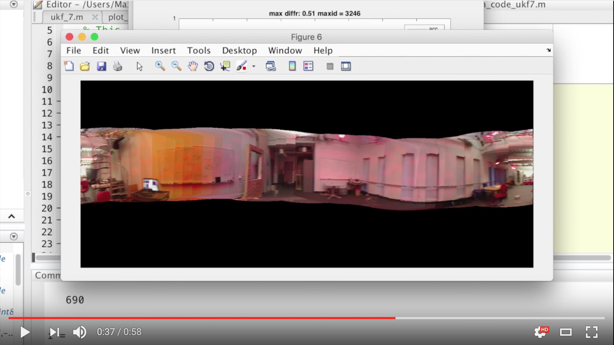

## Unscented Kalman Filter for Orientation Tracking

UPenn ESE 650 Learning in Robotics, Project 2. Implemeted Unscented Kalman Filter (UKF) for orientation tracking nad image stitching

- Project description: [report/ese650proj2_luyiren.pdf](report/ese650proj2_luyiren.pdf)
- Code demo: `./submission/run_code_ukf7.m`
- Panoramic image stitching video:

### References

- Edgar Kraft, A quaternion-based unscented kalman filter for orientation tracking. Information Fusion, 2003. Proceedings of the Sixth International Conference on Information Fusion, Vol. 1 (2003), pp. 47-54.
- Julier, Simon J., and Jeffrey K. Uhlmann. New extension of the Kalman filter to nonlinear systems. AeroSense’97. International Society for Optics and Photonics, 1997.